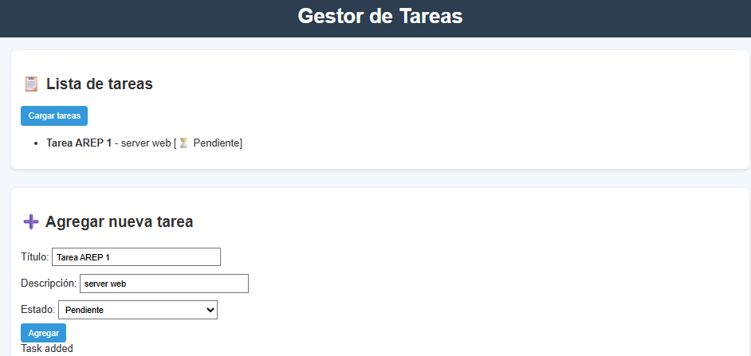

# Taller de Arquitecturas de Servidores de Aplicaciones, Meta protocolos de objetos, Patrón IoC, Reflexión

Framework web en Java para el desarrollo de aplicaciones con servicios REST backend y gestión de archivos estáticos.

## Características Principales

* Definición de controladores con anotaciones @RestController.
* Soporte para mapeo de rutas mediante @GetMapping.
* Manejo de parámetros de consulta con @RequestParam, incluyendo valores por defecto.
* Descubrimiento automático de controladores en el classpath.
* Servidor HTTP embebido que atiende tanto recursos estáticos como servicios REST.
* Soporte para archivos HTML, JavaScript, CSS e imágenes desde la carpeta public/.

### Prerequisitos

* Java 8 o superior
* Maven
* Browser

## Instalación y Ejecución

1. Clona el repositorio
   ```
    https://github.com/DavidBarbosag/lab3AREP.git
   ```

2. Entra al directorio del proyecto
3. Compila el proyecto con Maven
   ```
     mvn clean package
   ```
4. Ejecuta el servidor
  ```
 java -cp target/classes miniSpringBoot.MicroSpringBoot  
 ```

5. Accede mediante este url http://localhost:35000.


## Estructura del proyecto

```
http-mini-server/
├── assets/                          # Imágenes y recursos estáticos para la documentación
│   ├── exampleStaticFiles.png
│   ├── img.png
│   └── taskSended.png
│
├── public/                          # Archivos estáticos servidos por el servidor
│   ├── index.html
│   ├── style.css
│   ├── app.js
│   └── img/
│       └── test.jpg
│
├── src/
│   ├── main/
│   │   └── java/
│   │       └── httpserver/
│   │           ├── HttpRequest.java
│   │           ├── HttpResponse.java
│   │           ├── HttpServer.java
│   │           └── Service.java
│   │        └── miniSpringBoot/
│   │            ├── GetMapping.java
│   │            ├── GreetingController.java
│   │            ├── MicroSpringBoot.java
│   │            ├── RequestParam.java
│   │            └── RestController.java
│   │       └── TaskNote/
│   │           └── Task.java
│   │            
│   │
│   └── test/
│       └── java/
│           └── http/
│               └── AppTest.java
│
├── pom.xml                          # Archivo de configuración de Maven
└── README.md                        # Documentación del proyecto
```

## Arquitectura

El miniSpringBoot implementa un patrón IoC (Inversión de Control) usando reflexión:


* HttpServer:
    Gestiona las conexiones entrantes, identifica si la petición es un recurso estático o un servicio REST, y envía la respuesta.

* RestController (anotación):

    Marca las clases que definen endpoints REST.

* GetMapping (anotación):

    Define el path del servicio REST que responde a peticiones GET.

* RequestParam (anotación):

    Permite acceder a parámetros de consulta en la URL con valores por defecto.

* Controladores (ejemplo GreetingController):

    Implementan los endpoints de la aplicación.

El flujo básico consiste en recibir una solicitud HTTP, identificar si es para un recurso estático o para la API,
y responder en consecuencia. La comunicación entre módulos se realiza mediante clases Java simples, facilitando la extensión
y el mantenimiento.

## Uso

* Para ver la página principal:
  http://localhost:35000/


* Al agregar una tarea, se muestran en la lista de tareas.



* Para consultar las tareas (API):
  http://localhost:35000/api/tasks

* Para mostrar los archivos estáticos:
  http://localhost:35000/<ruta_del_archivo>
  (Muestra el contenido del archivo si existe).


## Endpoints Definidos

* Página principal

    http://localhost:35000/

* Servicio REST con parámetro

    http://localhost:35000/app/greeting?name=David


* Respuesta → Hola <nombre> y por defecto Hola World

Con valor por defecto

http://localhost:35000/app/greeting


Respuesta → Hola World

http://localhost:35000/app/greeting?name=nombre


* Archivos estáticos

    http://localhost:35000/index.html
    http://localhost:35000/style.css


## Análisis estático


## Authors
David Alfonso Barbosa Gómez

   
